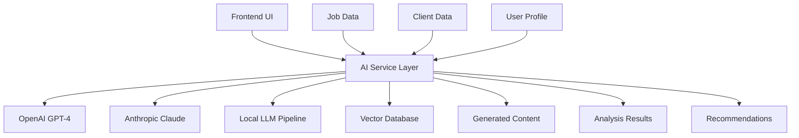

# AI Integration Architecture Plan

## 🤖 AI Integration Overview

### **AI-Powered Features**
1. **Intelligent Proposal Generation** - Context-aware, personalized proposals
2. **Job Analysis & Scoring** - Automated job quality assessment
3. **Client Risk Assessment** - AI-driven client evaluation
4. **Voice Pattern Matching** - Tone and style adaptation
5. **Market Intelligence** - Trend analysis and predictions
6. **Content Optimization** - Proposal improvement suggestions

### **AI Service Architecture**


## 🧠 AI Service Layer Design

### **Core AI Service Interface**
```typescript
interface AIService {
  // Proposal generation
  generateProposal(context: ProposalContext): Promise<ProposalResult>;
  improveProposal(content: string, suggestions: string[]): Promise<string>;

  // Job analysis
  analyzeJob(job: JobData): Promise<JobAnalysis>;
  scoreJob(job: JobData, userProfile: UserProfile): Promise<JobScore>;

  // Client intelligence
  assessClient(client: ClientData): Promise<ClientAssessment>;
  predictSuccess(job: JobData, client: ClientData): Promise<SuccessPrediction>;

  // Content optimization
  extractVoicePattern(samples: string[]): Promise<VoiceProfile>;
  adaptToVoice(content: string, voice: VoiceProfile): Promise<string>;

  // Market intelligence
  analyzeTrends(timeRange: TimeRange): Promise<MarketTrends>;
  suggestOptimizations(userMetrics: UserMetrics): Promise<Optimization[]>;
}
```

### **AI Service Implementation**
```typescript
// src/lib/ai/ai-service.ts
import { OpenAIService } from './providers/openai-service';
import { AnthropicService } from './providers/anthropic-service';
import { VectorService } from './providers/vector-service';

export class AIService implements IAIService {
  private openai: OpenAIService;
  private anthropic: AnthropicService;
  private vectorDb: VectorService;

  constructor() {
    this.openai = new OpenAIService();
    this.anthropic = new AnthropicService();
    this.vectorDb = new VectorService();
  }

  async generateProposal(context: ProposalContext): Promise<ProposalResult> {
    // 1. Analyze job requirements
    const jobAnalysis = await this.analyzeJob(context.job);

    // 2. Research client background
    const clientProfile = await this.assessClient(context.client);

    // 3. Extract user voice pattern
    const userVoice = await this.extractVoicePattern(context.previousProposals);

    // 4. Find similar successful proposals
    const similarProposals = await this.findSimilarProposals(context.job);

    // 5. Generate proposal using GPT-4
    const proposal = await this.openai.generateProposal({
      job: jobAnalysis,
      client: clientProfile,
      voice: userVoice,
      examples: similarProposals,
      template: context.template
    });

    // 6. Refine with Claude for quality
    const refinedProposal = await this.anthropic.refineContent(proposal, {
      tone: userVoice.tone,
      requirements: jobAnalysis.requirements,
      clientPreferences: clientProfile.preferences
    });

    return {
      content: refinedProposal,
      confidence: this.calculateConfidence(proposal, refinedProposal),
      suggestions: await this.generateSuggestions(refinedProposal, context),
      metadata: {
        tokensUsed: proposal.tokensUsed + refinedProposal.tokensUsed,
        models: ['gpt-4', 'claude-3'],
        processingTime: Date.now() - context.startTime
      }
    };
  }

  async analyzeJob(job: JobData): Promise<JobAnalysis> {
    const prompt = this.buildJobAnalysisPrompt(job);

    const analysis = await this.anthropic.analyze(prompt, {
      outputFormat: 'structured',
      schema: jobAnalysisSchema
    });

    return {
      requirements: analysis.requirements,
      complexity: analysis.complexity,
      budget: analysis.budgetAssessment,
      timeline: analysis.timeline,
      skills: analysis.skillsRequired,
      redFlags: analysis.redFlags,
      opportunities: analysis.opportunities,
      score: this.calculateJobScore(analysis)
    };
  }

  private async findSimilarProposals(job: JobData): Promise<ProposalExample[]> {
    // Create embedding for job description
    const jobEmbedding = await this.vectorDb.createEmbedding(job.description);

    // Search for similar successful proposals
    const similarProposals = await this.vectorDb.search({
      vector: jobEmbedding,
      filter: { status: 'accepted' },
      limit: 5
    });

    return similarProposals.map(result => ({
      content: result.content,
      similarity: result.score,
      context: result.metadata
    }));
  }
}
```

## 🔮 AI Provider Implementations

### **OpenAI Service**
```typescript
// src/lib/ai/providers/openai-service.ts
import OpenAI from 'openai';

export class OpenAIService {
  private client: OpenAI;

  constructor() {
    this.client = new OpenAI({
      apiKey: process.env.OPENAI_API_KEY,
    });
  }

  async generateProposal(context: ProposalGenerationContext): Promise<GenerationResult> {
    const prompt = this.buildProposalPrompt(context);

    const completion = await this.client.chat.completions.create({
      model: 'gpt-4-turbo-preview',
      messages: [
        {
          role: 'system',
          content: PROPOSAL_GENERATION_SYSTEM_PROMPT
        },
        {
          role: 'user',
          content: prompt
        }
      ],
      temperature: 0.7,
      max_tokens: 2000,
      stream: false
    });

    return {
      content: completion.choices[0]?.message?.content || '',
      tokensUsed: completion.usage?.total_tokens || 0,
      model: completion.model,
      finishReason: completion.choices[0]?.finish_reason
    };
  }

  async generateStream(prompt: string): Promise<ReadableStream> {
    const stream = await this.client.chat.completions.create({
      model: 'gpt-4-turbo-preview',
      messages: [{ role: 'user', content: prompt }],
      stream: true
    });

    return new ReadableStream({
      async start(controller) {
        for await (const chunk of stream) {
          const content = chunk.choices[0]?.delta?.content || '';
          if (content) {
            controller.enqueue(new TextEncoder().encode(content));
          }
        }
        controller.close();
      }
    });
  }

  private buildProposalPrompt(context: ProposalGenerationContext): string {
    return `
      Generate a compelling Upwork proposal based on the following context:

      ## Job Details
      Title: ${context.job.title}
      Description: ${context.job.description}
      Budget: ${context.job.budget}
      Skills: ${context.job.skills.join(', ')}

      ## Client Profile
      Name: ${context.client.name}
      Total Spent: $${context.client.totalSpent}
      Hire Rate: ${context.client.hireRate}%
      Preferences: ${context.client.preferences}

      ## User Voice Pattern
      Tone: ${context.voice.tone}
      Style: ${context.voice.style}
      Key Phrases: ${context.voice.keyPhrases.join(', ')}

      ## Similar Successful Proposals
      ${context.examples.map(ex => `Example: ${ex.content.slice(0, 200)}...`).join('\n')}

      Generate a personalized proposal that:
      1. Addresses the specific job requirements
      2. Matches the client's communication style
      3. Uses the user's authentic voice
      4. Demonstrates relevant experience
      5. Includes a clear call to action
    `;
  }
}
```

### **Anthropic Claude Service**
```typescript
// src/lib/ai/providers/anthropic-service.ts
import Anthropic from '@anthropic-ai/sdk';

export class AnthropicService {
  private client: Anthropic;

  constructor() {
    this.client = new Anthropic({
      apiKey: process.env.ANTHROPIC_API_KEY,
    });
  }

  async analyze(prompt: string, options: AnalysisOptions): Promise<any> {
    const message = await this.client.messages.create({
      model: 'claude-3-5-sonnet-20241022',
      max_tokens: 4096,
      temperature: 0.1,
      system: ANALYSIS_SYSTEM_PROMPT,
      messages: [
        {
          role: 'user',
          content: prompt
        }
      ]
    });

    if (options.outputFormat === 'structured') {
      return JSON.parse(message.content[0].text);
    }

    return message.content[0].text;
  }

  async refineContent(content: string, guidelines: RefinementGuidelines): Promise<string> {
    const prompt = `
      Refine the following proposal to improve its effectiveness:

      ## Original Content
      ${content}

      ## Refinement Guidelines
      - Tone: ${guidelines.tone}
      - Key Requirements: ${guidelines.requirements.join(', ')}
      - Client Preferences: ${guidelines.clientPreferences.join(', ')}

      Improve clarity, persuasiveness, and alignment with client needs while maintaining the original voice.
    `;

    const message = await this.client.messages.create({
      model: 'claude-3-5-sonnet-20241022',
      max_tokens: 2000,
      temperature: 0.3,
      messages: [
        {
          role: 'user',
          content: prompt
        }
      ]
    });

    return message.content[0].text;
  }

  async assessRisk(data: any): Promise<RiskAssessment> {
    const prompt = `
      Analyze the following client data and assess potential risks:

      ${JSON.stringify(data, null, 2)}

      Provide a structured risk assessment including:
      1. Overall risk score (0-100)
      2. Specific risk factors
      3. Red flags
      4. Recommendations
      5. Confidence level
    `;

    const result = await this.analyze(prompt, {
      outputFormat: 'structured',
      schema: riskAssessmentSchema
    });

    return result;
  }
}
```

### **Vector Database Service**
```typescript
// src/lib/ai/providers/vector-service.ts
import { PineconeClient } from '@pinecone-database/pinecone';

export class VectorService {
  private pinecone: PineconeClient;
  private index: any;

  constructor() {
    this.pinecone = new PineconeClient();
    this.initializeIndex();
  }

  private async initializeIndex() {
    await this.pinecone.init({
      apiKey: process.env.PINECONE_API_KEY!,
      environment: process.env.PINECONE_ENVIRONMENT!,
    });

    this.index = this.pinecone.Index('upwork-proposals');
  }

  async createEmbedding(text: string): Promise<number[]> {
    const openai = new OpenAI();

    const response = await openai.embeddings.create({
      model: 'text-embedding-3-large',
      input: text
    });

    return response.data[0].embedding;
  }

  async storeProposal(proposal: ProposalData): Promise<void> {
    const embedding = await this.createEmbedding(proposal.content);

    await this.index.upsert({
      upsertRequest: {
        vectors: [{
          id: proposal.id,
          values: embedding,
          metadata: {
            content: proposal.content,
            jobType: proposal.jobType,
            status: proposal.status,
            successRate: proposal.successRate,
            tenantId: proposal.tenantId
          }
        }]
      }
    });
  }

  async search(query: SearchQuery): Promise<SearchResult[]> {
    const response = await this.index.query({
      queryRequest: {
        vector: query.vector,
        filter: query.filter,
        topK: query.limit,
        includeMetadata: true
      }
    });

    return response.matches.map(match => ({
      id: match.id,
      score: match.score,
      content: match.metadata.content,
      metadata: match.metadata
    }));
  }

  async findSimilarJobs(jobDescription: string, limit: number = 10): Promise<SimilarJob[]> {
    const embedding = await this.createEmbedding(jobDescription);

    const results = await this.search({
      vector: embedding,
      filter: { type: 'job' },
      limit
    });

    return results.map(result => ({
      id: result.id,
      similarity: result.score,
      description: result.content,
      metadata: result.metadata
    }));
  }
}
```

## 🎯 AI Feature Implementations

### **Proposal Generation Pipeline**
```typescript
// src/lib/ai/features/proposal-generator.ts
export class ProposalGenerator {
  private aiService: AIService;
  private templates: TemplateService;
  private analytics: AnalyticsService;

  async generateProposal(request: ProposalRequest): Promise<ProposalResponse> {
    const startTime = Date.now();

    try {
      // 1. Pre-processing
      const context = await this.buildContext(request);

      // 2. Generate multiple variants
      const variants = await Promise.all([
        this.generateVariant(context, 'professional'),
        this.generateVariant(context, 'friendly'),
        this.generateVariant(context, 'technical')
      ]);

      // 3. Score and rank variants
      const rankedVariants = await this.rankVariants(variants, context);

      // 4. Select best variant
      const bestProposal = rankedVariants[0];

      // 5. Generate improvements
      const suggestions = await this.generateImprovements(bestProposal, context);

      // 6. Track analytics
      await this.analytics.trackGeneration({
        userId: request.userId,
        jobId: request.jobId,
        model: 'hybrid',
        processingTime: Date.now() - startTime,
        variants: variants.length
      });

      return {
        proposal: bestProposal,
        alternatives: rankedVariants.slice(1),
        suggestions,
        metadata: {
          processingTime: Date.now() - startTime,
          confidence: bestProposal.confidence,
          tokensUsed: variants.reduce((sum, v) => sum + v.tokensUsed, 0)
        }
      };

    } catch (error) {
      await this.analytics.trackError({
        userId: request.userId,
        error: error.message,
        stage: 'generation'
      });
      throw error;
    }
  }

  private async buildContext(request: ProposalRequest): Promise<ProposalContext> {
    const [job, client, userProfile, templates, history] = await Promise.all([
      this.getJobDetails(request.jobId),
      this.getClientProfile(request.clientId),
      this.getUserProfile(request.userId),
      this.templates.getUserTemplates(request.userId),
      this.getProposalHistory(request.userId)
    ]);

    return {
      job,
      client,
      userProfile,
      templates,
      history,
      preferences: request.preferences
    };
  }

  private async generateVariant(
    context: ProposalContext,
    tone: 'professional' | 'friendly' | 'technical'
  ): Promise<ProposalVariant> {
    const tonePrompts = {
      professional: 'Maintain a formal, business-oriented tone',
      friendly: 'Use a warm, approachable tone while remaining professional',
      technical: 'Focus on technical expertise and detailed solutions'
    };

    const prompt = this.buildVariantPrompt(context, tonePrompts[tone]);

    const result = await this.aiService.generateProposal({
      ...context,
      toneGuideline: tonePrompts[tone]
    });

    return {
      content: result.content,
      tone,
      confidence: result.confidence,
      tokensUsed: result.metadata.tokensUsed
    };
  }
}
```

### **Job Analysis Engine**
```typescript
// src/lib/ai/features/job-analyzer.ts
export class JobAnalyzer {
  private aiService: AIService;
  private marketData: MarketDataService;

  async analyzeJob(job: JobData, userProfile: UserProfile): Promise<JobAnalysis> {
    const [
      contentAnalysis,
      clientAnalysis,
      marketComparison,
      skillsMatch
    ] = await Promise.all([
      this.analyzeContent(job),
      this.analyzeClient(job.client),
      this.compareWithMarket(job),
      this.calculateSkillsMatch(job.skills, userProfile.skills)
    ]);

    const riskFactors = this.identifyRiskFactors(job, clientAnalysis);
    const opportunities = this.identifyOpportunities(job, marketComparison);

    const overallScore = this.calculateOverallScore({
      contentQuality: contentAnalysis.quality,
      clientReliability: clientAnalysis.reliability,
      budgetFairness: marketComparison.budgetScore,
      skillsAlignment: skillsMatch,
      riskLevel: riskFactors.overallRisk
    });

    return {
      score: overallScore,
      contentAnalysis,
      clientAnalysis,
      marketComparison,
      skillsMatch,
      riskFactors,
      opportunities,
      recommendation: this.generateRecommendation(overallScore, riskFactors),
      estimatedSuccessRate: this.estimateSuccessRate(userProfile, job, overallScore)
    };
  }

  private async analyzeContent(job: JobData): Promise<ContentAnalysis> {
    const prompt = `
      Analyze this job posting for quality and clarity:

      Title: ${job.title}
      Description: ${job.description}
      Budget: ${job.budget}

      Assess:
      1. Clarity of requirements (0-100)
      2. Project scope definition (0-100)
      3. Budget reasonableness (0-100)
      4. Overall professionalism (0-100)
      5. Red flags present
      6. Missing information
    `;

    const analysis = await this.aiService.analyzeJob(job);

    return {
      clarity: analysis.clarity,
      scope: analysis.scope,
      budgetReasonableness: analysis.budgetReasonableness,
      professionalism: analysis.professionalism,
      redFlags: analysis.redFlags,
      missingInfo: analysis.missingInfo,
      quality: (analysis.clarity + analysis.scope + analysis.professionalism) / 3
    };
  }

  private calculateOverallScore(factors: ScoreFactors): number {
    const weights = {
      contentQuality: 0.25,
      clientReliability: 0.30,
      budgetFairness: 0.20,
      skillsAlignment: 0.15,
      riskLevel: 0.10
    };

    return Object.entries(factors).reduce((score, [factor, value]) => {
      const weight = weights[factor as keyof typeof weights];
      return score + (value * weight);
    }, 0);
  }
}
```

## 🔄 Real-time AI Features

### **Streaming Proposal Generation**
```typescript
// src/lib/ai/features/streaming-generator.ts
export class StreamingProposalGenerator {
  async *generateProposalStream(context: ProposalContext): AsyncGenerator<ProposalChunk> {
    const openai = new OpenAIService();

    const stream = await openai.generateStream(
      this.buildStreamingPrompt(context)
    );

    const reader = stream.getReader();
    let buffer = '';

    try {
      while (true) {
        const { done, value } = await reader.read();

        if (done) break;

        const chunk = new TextDecoder().decode(value);
        buffer += chunk;

        // Yield complete sentences or paragraphs
        const sentences = buffer.split(/[.!?]+/);

        if (sentences.length > 1) {
          const completeSentences = sentences.slice(0, -1);
          buffer = sentences[sentences.length - 1];

          for (const sentence of completeSentences) {
            if (sentence.trim()) {
              yield {
                type: 'content',
                content: sentence.trim() + '. ',
                timestamp: Date.now()
              };
            }
          }
        }
      }

      // Yield remaining buffer
      if (buffer.trim()) {
        yield {
          type: 'content',
          content: buffer.trim(),
          timestamp: Date.now()
        };
      }

      yield {
        type: 'complete',
        content: '',
        timestamp: Date.now()
      };

    } finally {
      reader.releaseLock();
    }
  }
}
```

### **Real-time Job Scoring**
```typescript
// src/lib/ai/features/real-time-scorer.ts
export class RealTimeJobScorer {
  private scoreCache = new Map<string, JobScore>();
  private batchProcessor: BatchProcessor;

  constructor() {
    this.batchProcessor = new BatchProcessor({
      batchSize: 10,
      interval: 2000,
      processor: this.processBatch.bind(this)
    });
  }

  async scoreJob(job: JobData): Promise<JobScore> {
    // Check cache first
    const cached = this.scoreCache.get(job.id);
    if (cached && this.isCacheValid(cached)) {
      return cached;
    }

    // Add to batch for processing
    return new Promise((resolve) => {
      this.batchProcessor.add({
        jobId: job.id,
        job,
        resolve
      });
    });
  }

  private async processBatch(items: ScoringRequest[]): Promise<void> {
    const jobs = items.map(item => item.job);

    // Batch process jobs for efficiency
    const scores = await this.batchScore(jobs);

    // Cache and resolve promises
    items.forEach((item, index) => {
      const score = scores[index];
      this.scoreCache.set(item.jobId, score);
      item.resolve(score);
    });
  }

  private async batchScore(jobs: JobData[]): Promise<JobScore[]> {
    const prompt = this.buildBatchScoringPrompt(jobs);

    const result = await this.aiService.analyze(prompt, {
      outputFormat: 'structured',
      schema: batchJobScoreSchema
    });

    return result.scores;
  }
}
```

## 📊 AI Analytics & Monitoring

### **AI Usage Tracking**
```typescript
// src/lib/ai/analytics/usage-tracker.ts
export class AIUsageTracker {
  async trackGeneration(event: AIGenerationEvent): Promise<void> {
    await db.insert(aiGenerations).values({
      tenantId: event.tenantId,
      userId: event.userId,
      generationType: event.type,
      inputData: event.inputData,
      generatedContent: event.output,
      tokensUsed: event.tokensUsed,
      cost: this.calculateCost(event.tokensUsed, event.model),
      modelVersion: event.model,
      isAccepted: false
    });

    // Update usage metrics
    await this.updateUsageMetrics(event.tenantId, event.tokensUsed, event.cost);
  }

  async trackAcceptance(generationId: string): Promise<void> {
    await db
      .update(aiGenerations)
      .set({ isAccepted: true })
      .where(eq(aiGenerations.id, generationId));
  }

  async getUsageReport(tenantId: string, timeRange: TimeRange): Promise<UsageReport> {
    const usage = await db
      .select({
        date: sql<string>`DATE(created_at)`,
        totalGenerations: count(),
        totalTokens: sum(aiGenerations.tokensUsed),
        totalCost: sum(aiGenerations.cost),
        acceptanceRate: sql<number>`AVG(CASE WHEN is_accepted THEN 1.0 ELSE 0.0 END)`
      })
      .from(aiGenerations)
      .where(
        and(
          eq(aiGenerations.tenantId, tenantId),
          gte(aiGenerations.createdAt, timeRange.start),
          lte(aiGenerations.createdAt, timeRange.end)
        )
      )
      .groupBy(sql`DATE(created_at)`)
      .orderBy(sql`DATE(created_at) DESC`);

    return {
      usage,
      summary: this.calculateSummary(usage),
      projections: await this.calculateProjections(tenantId, usage)
    };
  }
}
```

### **Model Performance Monitoring**
```typescript
// src/lib/ai/analytics/performance-monitor.ts
export class AIPerformanceMonitor {
  async trackModelPerformance(metrics: ModelMetrics): Promise<void> {
    // Track response time, accuracy, user satisfaction
    await this.recordMetrics(metrics);

    // Check for performance degradation
    if (await this.detectDegradation(metrics)) {
      await this.alertOpsTeam(metrics);
    }
  }

  async generatePerformanceReport(): Promise<PerformanceReport> {
    const [responseTimeStats, accuracyStats, userSatisfaction] = await Promise.all([
      this.getResponseTimeStats(),
      this.getAccuracyStats(),
      this.getUserSatisfactionStats()
    ]);

    return {
      responseTime: responseTimeStats,
      accuracy: accuracyStats,
      userSatisfaction,
      recommendations: await this.generateRecommendations()
    };
  }
}
```

This comprehensive AI integration plan provides a robust, scalable foundation for implementing intelligent features across the AI Upwork Agent platform while maintaining performance, cost efficiency, and user experience.