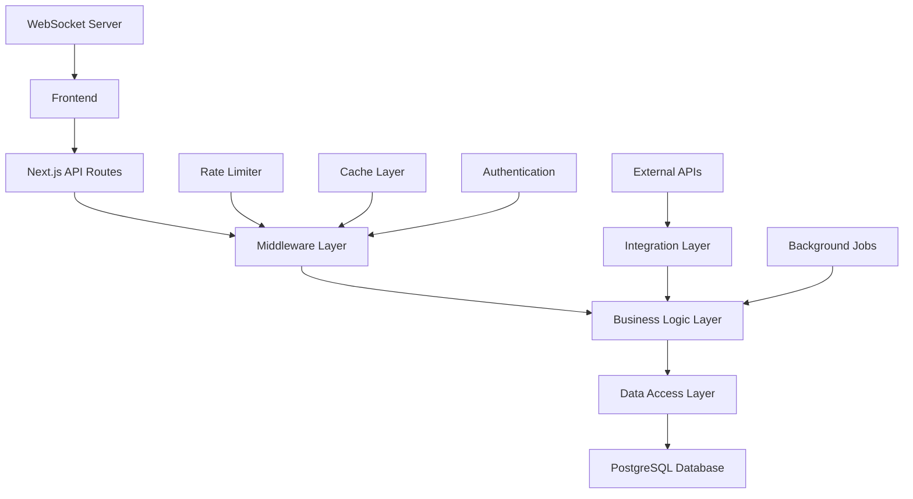

# API Layer Design & Data Flow Architecture

## 🌐 API Architecture Overview

### **API Design Principles**
1. **RESTful Design** - Consistent resource-based URLs
2. **Type Safety** - End-to-end TypeScript with shared types
3. **Rate Limiting** - Intelligent throttling and quota management
4. **Caching** - Multi-layer caching strategy
5. **Real-time Updates** - WebSocket connections for live data
6. **Multi-tenancy** - Tenant-aware endpoints with RLS

### **API Layer Structure**


## 🛡️ Middleware Stack

### **Authentication Middleware**
```typescript
// src/middleware/auth.ts
import { auth } from '@clerk/nextjs';
import { NextRequest, NextResponse } from 'next/server';

export async function authMiddleware(req: NextRequest) {
  const { userId, orgId } = auth();

  if (!userId) {
    return NextResponse.json(
      { error: 'Unauthorized' },
      { status: 401 }
    );
  }

  // Set tenant context for RLS
  if (orgId) {
    req.headers.set('x-tenant-id', orgId);
  }

  return NextResponse.next({
    request: {
      headers: req.headers,
    },
  });
}
```

### **Rate Limiting Middleware**
```typescript
// src/middleware/rate-limit.ts
import { Ratelimit } from '@upstash/ratelimit';
import { Redis } from '@upstash/redis';

const redis = new Redis({
  url: process.env.UPSTASH_REDIS_REST_URL!,
  token: process.env.UPSTASH_REDIS_REST_TOKEN!,
});

// Different rate limits for different endpoints
const rateLimiters = {
  default: new Ratelimit({
    redis,
    limiter: Ratelimit.slidingWindow(100, '1 m'),
  }),
  aiGeneration: new Ratelimit({
    redis,
    limiter: Ratelimit.slidingWindow(10, '1 m'),
  }),
  upworkApi: new Ratelimit({
    redis,
    limiter: Ratelimit.slidingWindow(30, '1 m'),
  }),
};

export async function rateLimitMiddleware(
  req: NextRequest,
  type: keyof typeof rateLimiters = 'default'
) {
  const ip = req.ip ?? '127.0.0.1';
  const { success, limit, reset, remaining } = await rateLimiters[type].limit(ip);

  if (!success) {
    return NextResponse.json(
      {
        error: 'Rate limit exceeded',
        limit,
        reset,
        remaining: 0,
      },
      {
        status: 429,
        headers: {
          'X-RateLimit-Limit': limit.toString(),
          'X-RateLimit-Remaining': '0',
          'X-RateLimit-Reset': reset.toString(),
        },
      }
    );
  }

  return NextResponse.next({
    request: req,
    headers: {
      'X-RateLimit-Limit': limit.toString(),
      'X-RateLimit-Remaining': remaining.toString(),
      'X-RateLimit-Reset': reset.toString(),
    },
  });
}
```

### **Validation Middleware**
```typescript
// src/middleware/validation.ts
import { ZodSchema } from 'zod';
import { NextRequest, NextResponse } from 'next/server';

export function validateRequest<T>(schema: ZodSchema<T>) {
  return async (req: NextRequest) => {
    try {
      const body = await req.json();
      const validatedData = schema.parse(body);

      // Attach validated data to request
      (req as any).validatedData = validatedData;

      return NextResponse.next();
    } catch (error) {
      return NextResponse.json(
        {
          error: 'Validation failed',
          details: error instanceof Error ? error.message : 'Unknown error',
        },
        { status: 400 }
      );
    }
  };
}
```

## 📡 API Route Definitions

### **Job Management APIs**
```typescript
// src/app/api/jobs/route.ts
import { NextRequest, NextResponse } from 'next/server';
import { getJobs, createJobSearch } from '@/lib/services/job-service';
import { jobSearchSchema } from '@/lib/validations/job-schemas';

export async function GET(req: NextRequest) {
  try {
    const { searchParams } = new URL(req.url);
    const filters = {
      skills: searchParams.get('skills')?.split(',') || [],
      minBudget: parseInt(searchParams.get('minBudget') || '0'),
      maxBudget: parseInt(searchParams.get('maxBudget') || '999999'),
      location: searchParams.get('location'),
      clientScore: parseInt(searchParams.get('clientScore') || '0'),
      page: parseInt(searchParams.get('page') || '1'),
      limit: parseInt(searchParams.get('limit') || '20'),
    };

    const result = await getJobs(filters);

    return NextResponse.json({
      success: true,
      data: result.jobs,
      pagination: {
        page: result.page,
        limit: result.limit,
        total: result.total,
        hasMore: result.hasMore,
      },
    });
  } catch (error) {
    return NextResponse.json(
      { error: 'Failed to fetch jobs' },
      { status: 500 }
    );
  }
}

export async function POST(req: NextRequest) {
  try {
    const body = await req.json();
    const validatedData = jobSearchSchema.parse(body);

    const savedSearch = await createJobSearch(validatedData);

    return NextResponse.json({
      success: true,
      data: savedSearch,
    });
  } catch (error) {
    return NextResponse.json(
      { error: 'Failed to create job search' },
      { status: 500 }
    );
  }
}
```

### **Proposal Generation API**
```typescript
// src/app/api/ai/proposals/generate/route.ts
import { NextRequest, NextResponse } from 'next/server';
import { ProposalGenerator } from '@/lib/ai/features/proposal-generator';
import { proposalGenerationSchema } from '@/lib/validations/ai-schemas';

export async function POST(req: NextRequest) {
  try {
    const body = await req.json();
    const validatedData = proposalGenerationSchema.parse(body);

    const generator = new ProposalGenerator();
    const result = await generator.generateProposal(validatedData);

    // Track usage for billing
    await trackAIUsage({
      userId: validatedData.userId,
      type: 'proposal_generation',
      tokensUsed: result.metadata.tokensUsed,
      cost: result.metadata.cost,
    });

    return NextResponse.json({
      success: true,
      data: {
        proposal: result.proposal,
        alternatives: result.alternatives,
        suggestions: result.suggestions,
        metadata: result.metadata,
      },
    });
  } catch (error) {
    return NextResponse.json(
      { error: 'Failed to generate proposal' },
      { status: 500 }
    );
  }
}
```

### **Streaming Proposal Generation**
```typescript
// src/app/api/ai/proposals/stream/route.ts
import { StreamingProposalGenerator } from '@/lib/ai/features/streaming-generator';

export async function POST(req: NextRequest) {
  try {
    const body = await req.json();
    const validatedData = proposalGenerationSchema.parse(body);

    const generator = new StreamingProposalGenerator();

    const stream = new ReadableStream({
      async start(controller) {
        try {
          for await (const chunk of generator.generateProposalStream(validatedData)) {
            controller.enqueue(
              new TextEncoder().encode(`data: ${JSON.stringify(chunk)}\n\n`)
            );
          }
        } catch (error) {
          controller.enqueue(
            new TextEncoder().encode(`data: ${JSON.stringify({ error: 'Generation failed' })}\n\n`)
          );
        } finally {
          controller.close();
        }
      },
    });

    return new Response(stream, {
      headers: {
        'Content-Type': 'text/event-stream',
        'Cache-Control': 'no-cache',
        'Connection': 'keep-alive',
      },
    });
  } catch (error) {
    return NextResponse.json(
      { error: 'Failed to start proposal generation' },
      { status: 500 }
    );
  }
}
```

### **Client Research API**
```typescript
// src/app/api/clients/[clientId]/research/route.ts
import { NextRequest, NextResponse } from 'next/server';
import { ClientAnalyzer } from '@/lib/ai/features/client-analyzer';

export async function GET(
  req: NextRequest,
  { params }: { params: { clientId: string } }
) {
  try {
    const analyzer = new ClientAnalyzer();
    const research = await analyzer.analyzeClient(params.clientId);

    return NextResponse.json({
      success: true,
      data: research,
    });
  } catch (error) {
    return NextResponse.json(
      { error: 'Failed to research client' },
      { status: 500 }
    );
  }
}
```

## 🔄 Real-time Data Flow

### **WebSocket Implementation**
```typescript
// src/lib/websocket/server.ts
import { Server as SocketIOServer } from 'socket.io';
import { auth } from '@clerk/nextjs';

export class WebSocketServer {
  private io: SocketIOServer;

  constructor(server: any) {
    this.io = new SocketIOServer(server, {
      cors: {
        origin: process.env.NEXT_PUBLIC_APP_URL,
        methods: ['GET', 'POST'],
      },
    });

    this.setupAuthentication();
    this.setupEventHandlers();
  }

  private setupAuthentication() {
    this.io.use(async (socket, next) => {
      try {
        const token = socket.handshake.auth.token;
        const { userId, orgId } = await auth({ token });

        if (!userId) {
          return next(new Error('Authentication failed'));
        }

        socket.userId = userId;
        socket.tenantId = orgId;

        // Join tenant room for multi-tenancy
        if (orgId) {
          socket.join(`tenant:${orgId}`);
        }

        next();
      } catch (error) {
        next(new Error('Authentication failed'));
      }
    });
  }

  private setupEventHandlers() {
    this.io.on('connection', (socket) => {
      console.log(`User connected: ${socket.userId}`);

      // Subscribe to job updates
      socket.on('subscribe:jobs', () => {
        socket.join(`jobs:${socket.tenantId}`);
      });

      // Subscribe to proposal updates
      socket.on('subscribe:proposals', () => {
        socket.join(`proposals:${socket.userId}`);
      });

      // Handle disconnection
      socket.on('disconnect', () => {
        console.log(`User disconnected: ${socket.userId}`);
      });
    });
  }

  // Broadcast new job to relevant users
  public broadcastNewJob(job: JobData, tenantId: string) {
    this.io.to(`jobs:${tenantId}`).emit('job:new', job);
  }

  // Notify user of proposal status change
  public notifyProposalUpdate(proposal: ProposalData, userId: string) {
    this.io.to(`proposals:${userId}`).emit('proposal:updated', proposal);
  }
}
```

### **Real-time Hooks**
```typescript
// src/hooks/use-real-time-jobs.ts
import { useEffect, useState } from 'react';
import { useSocket } from '@/lib/websocket/client';

export function useRealTimeJobs() {
  const socket = useSocket();
  const [newJobs, setNewJobs] = useState<JobData[]>([]);

  useEffect(() => {
    if (!socket) return;

    socket.emit('subscribe:jobs');

    socket.on('job:new', (job: JobData) => {
      setNewJobs(prev => [job, ...prev]);
    });

    return () => {
      socket.off('job:new');
    };
  }, [socket]);

  const clearNewJobs = () => setNewJobs([]);

  return { newJobs, clearNewJobs };
}
```

## 🔗 External API Integrations

### **Upwork API Client**
```typescript
// src/lib/integrations/upwork-client.ts
import { GraphQLClient } from 'graphql-request';

export class UpworkAPIClient {
  private client: GraphQLClient;
  private rateLimiter: RateLimiter;

  constructor(accessToken: string) {
    this.client = new GraphQLClient('https://api.upwork.com/graphql', {
      headers: {
        authorization: `Bearer ${accessToken}`,
      },
    });

    this.rateLimiter = new RateLimiter({
      requestsPerSecond: 10,
      maxRequestsPerDay: 40000,
    });
  }

  async getJobs(filters: JobFilters): Promise<JobData[]> {
    await this.rateLimiter.wait();

    const query = `
      query GetJobs($filters: JobFiltersInput!) {
        marketplaceJobPostingsSearch(filters: $filters) {
          totalCount
          edges {
            node {
              id
              title
              description
              skills
              budget {
                min
                max
                type
              }
              client {
                name
                location
                totalSpent
                hireRate
              }
              createdAt
              applicationDeadline
            }
          }
        }
      }
    `;

    const response = await this.client.request(query, { filters });
    return response.marketplaceJobPostingsSearch.edges.map(edge => edge.node);
  }

  async submitProposal(proposalData: ProposalSubmissionData): Promise<ProposalResponse> {
    await this.rateLimiter.wait();

    const mutation = `
      mutation SubmitProposal($input: ProposalInput!) {
        submitProposal(input: $input) {
          id
          status
          submittedAt
        }
      }
    `;

    return this.client.request(mutation, { input: proposalData });
  }

  async getClientProfile(clientId: string): Promise<ClientProfile> {
    await this.rateLimiter.wait();

    const query = `
      query GetClientProfile($id: ID!) {
        client(id: $id) {
          id
          name
          company
          location
          totalSpent
          hireRate
          avgRating
          jobsPosted
          activeJobs
          reviews {
            rating
            comment
            date
          }
        }
      }
    `;

    const response = await this.client.request(query, { id: clientId });
    return response.client;
  }
}
```

### **Rate Limiter Implementation**
```typescript
// src/lib/utils/rate-limiter.ts
export class RateLimiter {
  private requests: number[] = [];
  private dailyRequests: number = 0;
  private lastReset: Date = new Date();

  constructor(
    private config: {
      requestsPerSecond: number;
      maxRequestsPerDay: number;
    }
  ) {}

  async wait(): Promise<void> {
    this.resetDailyCountIfNeeded();

    if (this.dailyRequests >= this.config.maxRequestsPerDay) {
      throw new Error('Daily rate limit exceeded');
    }

    const now = Date.now();
    const oneSecondAgo = now - 1000;

    // Remove requests older than 1 second
    this.requests = this.requests.filter(time => time > oneSecondAgo);

    if (this.requests.length >= this.config.requestsPerSecond) {
      const oldestRequest = this.requests[0];
      const waitTime = 1000 - (now - oldestRequest);

      if (waitTime > 0) {
        await new Promise(resolve => setTimeout(resolve, waitTime));
      }
    }

    this.requests.push(now);
    this.dailyRequests++;
  }

  private resetDailyCountIfNeeded(): void {
    const now = new Date();
    if (now.getDate() !== this.lastReset.getDate()) {
      this.dailyRequests = 0;
      this.lastReset = now;
    }
  }
}
```

## 📊 Caching Strategy

### **Multi-layer Caching**
```typescript
// src/lib/cache/cache-manager.ts
export class CacheManager {
  private redis: Redis;
  private memoryCache: Map<string, any> = new Map();

  constructor() {
    this.redis = new Redis(process.env.REDIS_URL!);
  }

  async get<T>(key: string): Promise<T | null> {
    // Check memory cache first (L1)
    if (this.memoryCache.has(key)) {
      return this.memoryCache.get(key);
    }

    // Check Redis cache (L2)
    const cached = await this.redis.get(key);
    if (cached) {
      const data = JSON.parse(cached);
      this.memoryCache.set(key, data);
      return data;
    }

    return null;
  }

  async set(key: string, value: any, ttl: number = 3600): Promise<void> {
    // Set in memory cache (L1)
    this.memoryCache.set(key, value);

    // Set in Redis cache (L2)
    await this.redis.setex(key, ttl, JSON.stringify(value));
  }

  async invalidate(pattern: string): Promise<void> {
    // Clear memory cache
    for (const key of this.memoryCache.keys()) {
      if (key.includes(pattern)) {
        this.memoryCache.delete(key);
      }
    }

    // Clear Redis cache
    const keys = await this.redis.keys(`*${pattern}*`);
    if (keys.length > 0) {
      await this.redis.del(...keys);
    }
  }
}

// Cache decorators for services
export function cached(ttl: number = 3600) {
  return function (target: any, propertyName: string, descriptor: PropertyDescriptor) {
    const method = descriptor.value;

    descriptor.value = async function (...args: any[]) {
      const cacheKey = `${target.constructor.name}:${propertyName}:${JSON.stringify(args)}`;
      const cache = new CacheManager();

      const cached = await cache.get(cacheKey);
      if (cached) {
        return cached;
      }

      const result = await method.apply(this, args);
      await cache.set(cacheKey, result, ttl);

      return result;
    };
  };
}
```

### **Smart Cache Invalidation**
```typescript
// src/lib/cache/invalidation-manager.ts
export class CacheInvalidationManager {
  private cacheManager: CacheManager;

  constructor() {
    this.cacheManager = new CacheManager();
  }

  async invalidateOnJobUpdate(jobId: string): Promise<void> {
    await Promise.all([
      this.cacheManager.invalidate(`jobs:${jobId}`),
      this.cacheManager.invalidate('jobs:list'),
      this.cacheManager.invalidate('analytics:jobs'),
    ]);
  }

  async invalidateOnProposalUpdate(proposalId: string, userId: string): Promise<void> {
    await Promise.all([
      this.cacheManager.invalidate(`proposals:${proposalId}`),
      this.cacheManager.invalidate(`proposals:user:${userId}`),
      this.cacheManager.invalidate(`analytics:proposals:${userId}`),
    ]);
  }

  async invalidateOnUserUpdate(userId: string): Promise<void> {
    await Promise.all([
      this.cacheManager.invalidate(`user:${userId}`),
      this.cacheManager.invalidate(`proposals:user:${userId}`),
      this.cacheManager.invalidate(`templates:user:${userId}`),
    ]);
  }
}
```

## 🔍 Error Handling & Monitoring

### **Global Error Handler**
```typescript
// src/lib/error/error-handler.ts
export class APIErrorHandler {
  static handle(error: unknown, req: NextRequest): NextResponse {
    console.error('API Error:', error);

    // Log to monitoring service
    this.logError(error, req);

    if (error instanceof ValidationError) {
      return NextResponse.json(
        {
          error: 'Validation failed',
          details: error.errors,
        },
        { status: 400 }
      );
    }

    if (error instanceof AuthenticationError) {
      return NextResponse.json(
        { error: 'Authentication required' },
        { status: 401 }
      );
    }

    if (error instanceof RateLimitError) {
      return NextResponse.json(
        { error: 'Rate limit exceeded' },
        { status: 429 }
      );
    }

    // Generic server error
    return NextResponse.json(
      { error: 'Internal server error' },
      { status: 500 }
    );
  }

  private static logError(error: unknown, req: NextRequest): void {
    // Send to monitoring service (Sentry, DataDog, etc.)
    const errorData = {
      error: error instanceof Error ? error.message : String(error),
      stack: error instanceof Error ? error.stack : undefined,
      url: req.url,
      method: req.method,
      headers: Object.fromEntries(req.headers.entries()),
      timestamp: new Date().toISOString(),
    };

    // Log to external service
    this.sendToMonitoring(errorData);
  }
}
```

This comprehensive API design provides a robust, scalable foundation for the AI Upwork Agent platform with proper error handling, caching, real-time capabilities, and external integrations.