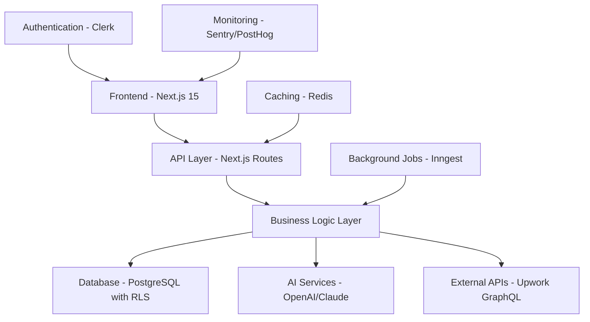
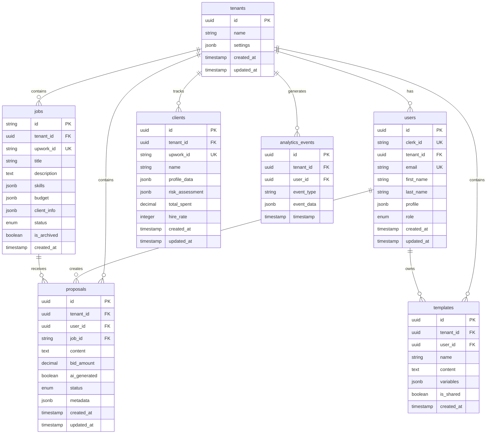

# AI Upwork Agent - Master Project Plan

## 🎯 Project Vision
Enterprise-grade AI-powered Upwork automation platform that transforms freelancer success through intelligent job discovery, AI-driven proposal generation, comprehensive client research, and performance optimization analytics.

## 📋 Core Requirements Summary

### **Primary Features**
1. **Smart Job Discovery** - Advanced filtering, real-time alerts, quality scoring
2. **AI Proposal Generation** - Context-aware, personalized, template-based
3. **Client Research Dashboard** - Background analysis, risk assessment, success prediction
4. **Performance Analytics** - Success metrics, revenue tracking, optimization insights
5. **Multi-tenant Architecture** - Organization support, role-based permissions
6. **Real-time Collaboration** - Team features, shared templates, analytics

### **Technical Requirements**
- **Scalable Architecture** supporting 1000+ organizations
- **Real-time Updates** for job alerts and proposal tracking
- **AI Integration** with OpenAI and Anthropic Claude
- **Mobile Responsive** design with offline capabilities
- **Enterprise Security** with SOC2 compliance readiness

## 🏗️ System Architecture Overview



## 📁 Comprehensive Project Structure

```
upwork-ai-agent/
├── 📱 Frontend Application
│   ├── src/app/                          # Next.js 15 App Router
│   │   ├── (auth)/                       # Authentication routes
│   │   │   ├── sign-in/[[...sign-in]]/
│   │   │   ├── sign-up/[[...sign-up]]/
│   │   │   └── organization-selection/
│   │   ├── (dashboard)/                  # Protected dashboard
│   │   │   ├── overview/                 # Main dashboard
│   │   │   ├── jobs/                     # Job discovery & management
│   │   │   │   ├── discover/
│   │   │   │   ├── saved/
│   │   │   │   ├── applied/
│   │   │   │   └── [jobId]/
│   │   │   ├── proposals/                # Proposal management
│   │   │   │   ├── drafts/
│   │   │   │   ├── sent/
│   │   │   │   ├── templates/
│   │   │   │   └── [proposalId]/
│   │   │   ├── clients/                  # Client research & management
│   │   │   │   ├── research/
│   │   │   │   ├── favorites/
│   │   │   │   └── [clientId]/
│   │   │   ├── analytics/                # Performance analytics
│   │   │   │   ├── overview/
│   │   │   │   ├── proposals/
│   │   │   │   ├── revenue/
│   │   │   │   └── trends/
│   │   │   ├── team/                     # Team management
│   │   │   │   ├── members/
│   │   │   │   ├── roles/
│   │   │   │   └── invitations/
│   │   │   └── settings/                 # User & org settings
│   │   │       ├── profile/
│   │   │       ├── preferences/
│   │   │       ├── billing/
│   │   │       └── integrations/
│   │   ├── api/                          # API Routes
│   │   │   ├── auth/                     # Authentication endpoints
│   │   │   ├── organizations/            # Multi-tenant management
│   │   │   ├── upwork/                   # Upwork API integration
│   │   │   │   ├── jobs/
│   │   │   │   ├── proposals/
│   │   │   │   └── profile/
│   │   │   ├── ai/                       # AI service endpoints
│   │   │   │   ├── proposals/
│   │   │   │   ├── analysis/
│   │   │   │   └── voice-matching/
│   │   │   ├── analytics/                # Analytics API
│   │   │   ├── webhooks/                 # External webhooks
│   │   │   └── cron/                     # Scheduled tasks
│   │   ├── globals.css                   # Global styles
│   │   ├── layout.tsx                    # Root layout
│   │   ├── page.tsx                      # Landing page
│   │   ├── loading.tsx                   # Global loading UI
│   │   ├── error.tsx                     # Global error UI
│   │   └── not-found.tsx                 # 404 page
│   ├── src/components/                   # React Components
│   │   ├── ui/                           # shadcn/ui base components
│   │   │   ├── button.tsx
│   │   │   ├── card.tsx
│   │   │   ├── dialog.tsx
│   │   │   ├── form.tsx
│   │   │   ├── table.tsx
│   │   │   └── toast.tsx
│   │   ├── layout/                       # Layout components
│   │   │   ├── app-shell.tsx
│   │   │   ├── header.tsx
│   │   │   ├── sidebar.tsx
│   │   │   ├── navigation.tsx
│   │   │   └── footer.tsx
│   │   ├── forms/                        # Form components
│   │   │   ├── job-filters-form.tsx
│   │   │   ├── proposal-form.tsx
│   │   │   ├── template-form.tsx
│   │   │   └── settings-form.tsx
│   │   ├── dashboard/                    # Dashboard-specific components
│   │   │   ├── overview/
│   │   │   │   ├── metrics-cards.tsx
│   │   │   │   ├── recent-activity.tsx
│   │   │   │   └── quick-actions.tsx
│   │   │   ├── jobs/
│   │   │   │   ├── job-card.tsx
│   │   │   │   ├── job-filters.tsx
│   │   │   │   ├── job-search.tsx
│   │   │   │   └── saved-searches.tsx
│   │   │   ├── proposals/
│   │   │   │   ├── proposal-editor.tsx
│   │   │   │   ├── ai-assistant.tsx
│   │   │   │   ├── template-selector.tsx
│   │   │   │   └── proposal-history.tsx
│   │   │   ├── clients/
│   │   │   │   ├── client-card.tsx
│   │   │   │   ├── client-research.tsx
│   │   │   │   ├── risk-assessment.tsx
│   │   │   │   └── client-history.tsx
│   │   │   └── analytics/
│   │   │       ├── performance-charts.tsx
│   │   │       ├── revenue-tracking.tsx
│   │   │       ├── success-metrics.tsx
│   │   │       └── trend-analysis.tsx
│   │   ├── charts/                       # Chart components
│   │   │   ├── line-chart.tsx
│   │   │   ├── bar-chart.tsx
│   │   │   ├── pie-chart.tsx
│   │   │   └── area-chart.tsx
│   │   ├── providers/                    # Context providers
│   │   │   ├── auth-provider.tsx
│   │   │   ├── theme-provider.tsx
│   │   │   ├── query-provider.tsx
│   │   │   └── tenant-provider.tsx
│   │   └── common/                       # Common/shared components
│   │       ├── loading-spinner.tsx
│   │       ├── error-boundary.tsx
│   │       ├── confirm-dialog.tsx
│   │       └── data-table.tsx
│   ├── src/lib/                          # Core libraries & utilities
│   │   ├── db/                           # Database configuration
│   │   │   ├── index.ts                  # DB connection & client
│   │   │   ├── schema.ts                 # Drizzle schema definitions
│   │   │   ├── queries.ts                # Common queries
│   │   │   ├── rls.sql                   # Row-level security policies
│   │   │   └── migrations/               # Database migrations
│   │   ├── auth/                         # Authentication utilities
│   │   │   ├── clerk-config.ts
│   │   │   ├── permissions.ts
│   │   │   └── middleware.ts
│   │   ├── ai/                           # AI service integrations
│   │   │   ├── openai-client.ts
│   │   │   ├── anthropic-client.ts
│   │   │   ├── prompt-templates.ts
│   │   │   ├── proposal-generator.ts
│   │   │   └── voice-analyzer.ts
│   │   ├── upwork/                       # Upwork API integration
│   │   │   ├── graphql-client.ts
│   │   │   ├── job-fetcher.ts
│   │   │   ├── profile-manager.ts
│   │   │   └── rate-limiter.ts
│   │   ├── analytics/                    # Analytics & tracking
│   │   │   ├── metrics-collector.ts
│   │   │   ├── event-tracker.ts
│   │   │   └── performance-monitor.ts
│   │   ├── tenant/                       # Multi-tenancy utilities
│   │   │   ├── context.tsx
│   │   │   ├── resolver.ts
│   │   │   └── permissions.ts
│   │   ├── cache/                        # Caching layer
│   │   │   ├── redis-client.ts
│   │   │   └── cache-strategies.ts
│   │   ├── jobs/                         # Background job processing
│   │   │   ├── inngest-client.ts
│   │   │   └── job-definitions.ts
│   │   ├── utils.ts                      # General utilities
│   │   ├── constants.ts                  # Application constants
│   │   ├── validations.ts                # Zod validation schemas
│   │   └── types.ts                      # Shared type definitions
│   ├── src/hooks/                        # Custom React hooks
│   │   ├── use-tenant.ts                 # Tenant context hook
│   │   ├── use-upwork-jobs.ts           # Job fetching hook
│   │   ├── use-ai-proposal.ts           # AI proposal generation
│   │   ├── use-analytics.ts             # Analytics data hook
│   │   ├── use-client-research.ts       # Client research hook
│   │   ├── use-permissions.ts           # Permission checking
│   │   ├── use-real-time.ts            # Real-time updates
│   │   └── use-local-storage.ts        # Local storage management
│   ├── src/store/                        # Zustand state stores
│   │   ├── tenant-store.ts               # Multi-tenant state
│   │   ├── jobs-store.ts                 # Job management state
│   │   ├── proposals-store.ts            # Proposal state
│   │   ├── clients-store.ts              # Client data state
│   │   ├── analytics-store.ts            # Analytics state
│   │   ├── ui-store.ts                   # UI state management
│   │   └── user-preferences-store.ts     # User preferences
│   └── src/types/                        # TypeScript definitions
│       ├── tenant.ts                     # Multi-tenancy types
│       ├── upwork.ts                     # Upwork API types
│       ├── ai.ts                         # AI service types
│       ├── analytics.ts                  # Analytics types
│       ├── database.ts                   # Database types
│       ├── forms.ts                      # Form validation types
│       └── api.ts                        # API response types
├── 📦 Configuration & Setup
│   ├── public/                           # Static assets
│   │   ├── icons/
│   │   ├── images/
│   │   └── manifest.json
│   ├── drizzle/                          # Database migrations
│   ├── tests/                            # Test files
│   │   ├── unit/
│   │   ├── integration/
│   │   └── e2e/
│   ├── scripts/                          # Build & deployment scripts
│   │   ├── seed-database.ts
│   │   ├── migrate-production.ts
│   │   └── deploy.sh
│   ├── .env.local                        # Environment variables
│   ├── .env.example                      # Environment template
│   ├── components.json                   # shadcn/ui configuration
│   ├── drizzle.config.ts                 # Drizzle ORM configuration
│   ├── middleware.ts                     # Next.js middleware
│   ├── next.config.ts                    # Next.js configuration
│   ├── tailwind.config.ts                # Tailwind CSS configuration
│   ├── tsconfig.json                     # TypeScript configuration
│   ├── package.json                      # Dependencies & scripts
│   ├── README.md                         # Project documentation
│   └── CHANGELOG.md                      # Version history
└── 📚 Documentation & Planning
    ├── docs/                             # Technical documentation
    │   ├── architecture/
    │   │   ├── system-overview.md
    │   │   ├── database-design.md
    │   │   ├── api-architecture.md
    │   │   └── security-model.md
    │   ├── deployment/
    │   │   ├── environment-setup.md
    │   │   ├── ci-cd-pipeline.md
    │   │   └── monitoring-setup.md
    │   └── api/
    │       ├── endpoints.md
    │       ├── authentication.md
    │       └── rate-limiting.md
    ├── planning/                         # Project planning documents
    │   ├── PROJECT_MASTER_PLAN.md        # This file
    │   ├── DEVELOPMENT_PHASES.md         # Phased development plan
    │   ├── COMPONENT_HIERARCHY.md        # Component architecture
    │   ├── DATABASE_SCHEMA.md            # Database design
    │   ├── AI_INTEGRATION_PLAN.md        # AI architecture
    │   ├── THEMING_SYSTEM.md             # Design system
    │   └── API_DESIGN.md                 # API specification
    └── sessions/                         # Development session logs
        ├── session-001-planning.md
        ├── session-002-setup.md
        └── session-003-auth.md
```

## 🗄️ Database Schema Design

### **Core Entities**


## 🧩 Component Architecture

### **UI Component Hierarchy**
```
App
├── ClerkProvider (Authentication)
├── ThemeProvider (Dark/Light mode)
├── QueryProvider (TanStack Query)
├── TenantProvider (Multi-tenancy)
└── AppShell
    ├── Header
    │   ├── Logo
    │   ├── Navigation
    │   ├── ThemeToggle
    │   ├── OrganizationSwitcher
    │   └── UserButton
    ├── Sidebar
    │   ├── NavigationMenu
    │   ├── QuickActions
    │   └── StatusIndicators
    ├── MainContent
    │   ├── Dashboard
    │   │   ├── OverviewModule
    │   │   │   ├── MetricsCards
    │   │   │   ├── RecentActivity
    │   │   │   └── QuickActions
    │   │   ├── JobsModule
    │   │   │   ├── JobDiscovery
    │   │   │   ├── JobFilters
    │   │   │   ├── JobGrid/List
    │   │   │   └── SavedSearches
    │   │   ├── ProposalsModule
    │   │   │   ├── ProposalEditor
    │   │   │   ├── AIAssistant
    │   │   │   ├── TemplateLibrary
    │   │   │   └── ProposalHistory
    │   │   ├── ClientsModule
    │   │   │   ├── ClientSearch
    │   │   │   ├── ClientResearch
    │   │   │   ├── RiskAssessment
    │   │   │   └── ClientHistory
    │   │   ├── AnalyticsModule
    │   │   │   ├── PerformanceDashboard
    │   │   │   ├── RevenueCharts
    │   │   │   ├── SuccessMetrics
    │   │   │   └── TrendAnalysis
    │   │   └── SettingsModule
    │   │       ├── ProfileSettings
    │   │       ├── Preferences
    │   │       ├── TeamManagement
    │   │       └── Integrations
    │   └── ErrorBoundary
    └── Footer
        ├── StatusBar
        └── HelpButton
```

## 🤖 AI Integration Architecture

### **AI Service Layer**
```typescript
interface AIService {
  generateProposal(context: ProposalContext): Promise<string>;
  analyzeJob(jobData: JobData): Promise<JobAnalysis>;
  extractVoice(samples: string[]): Promise<VoiceProfile>;
  scoreClient(clientData: ClientData): Promise<RiskScore>;
}

// Service implementations
class OpenAIService implements AIService { }
class AnthropicService implements AIService { }
class HybridAIService implements AIService { } // Uses multiple providers
```

### **AI Features**
1. **Proposal Generation**
   - Context-aware content creation
   - Voice matching from historical proposals
   - Industry-specific templates
   - Real-time suggestions

2. **Job Analysis**
   - Requirement extraction
   - Budget reasonableness assessment
   - Success probability scoring
   - Red flag detection

3. **Client Intelligence**
   - Risk assessment scoring
   - Payment reliability prediction
   - Project success likelihood
   - Communication style analysis

## 🎨 Design System & Theming

### **Color Palette**
```typescript
const colorTokens = {
  // Brand colors
  primary: {
    50: '#eff6ff',   // Very light blue
    100: '#dbeafe',  // Light blue
    500: '#3b82f6',  // Main brand blue
    600: '#2563eb',  // Darker blue
    900: '#1e3a8a'   // Very dark blue
  },

  // Semantic colors
  success: '#10b981',    // Green
  warning: '#f59e0b',    // Amber
  error: '#ef4444',      // Red
  info: '#06b6d4',       // Cyan

  // Neutral scale (light mode)
  neutral: {
    50: '#f9fafb',
    100: '#f3f4f6',
    200: '#e5e7eb',
    300: '#d1d5db',
    400: '#9ca3af',
    500: '#6b7280',
    600: '#4b5563',
    700: '#374151',
    800: '#1f2937',
    900: '#111827'
  }
};
```

### **Typography Scale**
```typescript
const typography = {
  fontFamily: {
    sans: ['Inter', 'system-ui', 'sans-serif'],
    mono: ['JetBrains Mono', 'monospace']
  },
  fontSize: {
    xs: '0.75rem',      // 12px
    sm: '0.875rem',     // 14px
    base: '1rem',       // 16px
    lg: '1.125rem',     // 18px
    xl: '1.25rem',      // 20px
    '2xl': '1.5rem',    // 24px
    '3xl': '1.875rem',  // 30px
    '4xl': '2.25rem'    // 36px
  },
  fontWeight: {
    normal: '400',
    medium: '500',
    semibold: '600',
    bold: '700'
  }
};
```

### **Component Variants**
```typescript
// Button variants using CVA
const buttonVariants = cva(
  'inline-flex items-center justify-center rounded-md text-sm font-medium transition-colors',
  {
    variants: {
      variant: {
        default: 'bg-primary text-primary-foreground hover:bg-primary/90',
        destructive: 'bg-destructive text-destructive-foreground hover:bg-destructive/90',
        outline: 'border border-input bg-background hover:bg-accent',
        secondary: 'bg-secondary text-secondary-foreground hover:bg-secondary/80',
        ghost: 'hover:bg-accent hover:text-accent-foreground',
        link: 'text-primary underline-offset-4 hover:underline'
      },
      size: {
        default: 'h-10 px-4 py-2',
        sm: 'h-9 rounded-md px-3',
        lg: 'h-11 rounded-md px-8',
        icon: 'h-10 w-10'
      }
    },
    defaultVariants: {
      variant: 'default',
      size: 'default'
    }
  }
);
```

## 🚀 Development Phases

### **Phase 1: Foundation Setup (Week 1-2)**
1. Project initialization with Next.js 15
2. Database schema design and migration
3. Authentication with Clerk
4. Multi-tenant architecture implementation
5. Basic UI components with shadcn/ui
6. Development environment configuration

### **Phase 2: Core Features (Week 3-6)**
1. Job discovery and filtering system
2. Basic proposal management
3. Client research dashboard
4. User profile and settings
5. Real-time updates implementation
6. Mobile responsive design

### **Phase 3: AI Integration (Week 7-10)**
1. OpenAI/Claude API integration
2. Proposal generation system
3. Job analysis features
4. Client risk assessment
5. Voice matching algorithms
6. AI assistant interface

### **Phase 4: Analytics & Optimization (Week 11-14)**
1. Performance analytics dashboard
2. Revenue tracking system
3. Success metrics calculation
4. Trend analysis features
5. A/B testing framework
6. Performance optimization

### **Phase 5: Enterprise Features (Week 15-18)**
1. Advanced team collaboration
2. Role-based permissions
3. API rate limiting
4. Security enhancements
5. Compliance features
6. Advanced integrations

### **Phase 6: Polish & Launch (Week 19-20)**
1. User testing and feedback
2. Performance optimization
3. Security audit
4. Documentation completion
5. Deployment pipeline
6. Launch preparation

## 📊 Success Metrics & KPIs

### **Technical Metrics**
- **Performance**: < 2s page load time, 95%+ uptime
- **Scalability**: Support 1000+ concurrent users
- **Security**: Zero data breaches, SOC2 compliance
- **Code Quality**: 90%+ test coverage, TypeScript strict mode

### **Business Metrics**
- **User Engagement**: 70%+ daily active users
- **Feature Adoption**: 80%+ of users use core features
- **Proposal Success**: 25%+ improvement in success rates
- **Revenue Impact**: 30%+ increase in user earnings

### **User Experience Metrics**
- **Time Savings**: 50%+ reduction in job search time
- **Efficiency**: 40%+ faster proposal creation
- **Satisfaction**: 4.5+ star rating, 80%+ NPS score
- **Retention**: 85%+ monthly retention rate

## 🔧 Development Tools & Scripts

### **Essential Package Scripts**
```json
{
  "scripts": {
    "dev": "next dev --turbo",
    "build": "next build",
    "start": "next start",
    "lint": "next lint",
    "type-check": "tsc --noEmit",
    "test": "jest --watch",
    "test:coverage": "jest --coverage",
    "test:e2e": "playwright test",
    "db:generate": "drizzle-kit generate",
    "db:migrate": "drizzle-kit migrate",
    "db:studio": "drizzle-kit studio",
    "db:seed": "tsx scripts/seed-database.ts",
    "db:reset": "tsx scripts/reset-database.ts",
    "format": "prettier --write .",
    "format:check": "prettier --check .",
    "analyze": "ANALYZE=true npm run build",
    "deploy:staging": "vercel --target staging",
    "deploy:prod": "vercel --target production"
  }
}
```

## 📝 Session Documentation Template

### **Session Log Structure**
```markdown
# Session [NUMBER] - [TITLE]

## 📅 Session Info
- **Date**: YYYY-MM-DD
- **Duration**: X hours
- **Phase**: [Current development phase]
- **Lead Developer**: [Name]

## 🎯 Session Objectives
- [ ] Objective 1
- [ ] Objective 2
- [ ] Objective 3

## ✅ Completed Tasks
1. Task description with details
2. Another completed task

## 🚧 In Progress
- Task currently being worked on
- Status and next steps

## 🔮 Next Session Priority
1. High priority task
2. Medium priority task
3. Low priority task

## 🚨 Blockers & Decisions Needed
- Blocker description and proposed solution
- Decision needed with options

## 📊 Metrics & Performance
- Technical metrics achieved
- Performance improvements
- Code quality metrics

## 🎯 Phase Progress
- Current phase completion: X%
- Next milestone: [Description]
- Overall project progress: X%
```

This master plan provides a comprehensive roadmap for developing the AI Upwork Agent platform with clear structure, modular architecture, and detailed implementation guidelines.