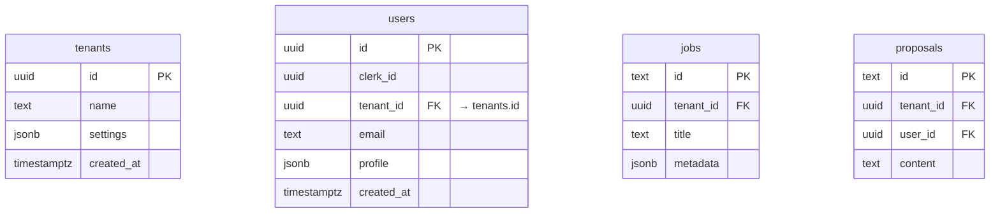

# Multi-Tenancy Layer — Upwork AI Agent

Designing for multi-tenancy **from day one** avoids painful refactors later and enables clean separation of customer data, permissions, and analytics. This guide extends the core project setup with a robust, scalable tenant layer that works seamlessly with **Next.js 15, Drizzle ORM, PostgreSQL, and Clerk**.

---

## 1  Selecting the Right Multi-Tenant Strategy

| Model | Isolation | Cost | Operational Complexity | Recommended For |
|-------|-----------|------|------------------------|-----------------|
| **DB-per-tenant** | Strong | High | High (migrations ×N) | Regulated industries, large enterprise contracts |
| **Schema-per-tenant** | High | Medium | Medium (schema management) | Small N (<100) high-value tenants |
| **Shared schema + Row-Level Security (RLS)** | Logical | Low | Low-Medium | SaaS apps with hundreds–thousands of tenants |

**Row-Level Security in PostgreSQL** provides the strongest blend of simplicity and isolation for a shared-schema model[104][109][115]. We adopt RLS and keep the door open for schema-per-tenant if enterprise customers require it later.

---

## 2  Database Design

### 2.1  Core Tables



> **Key rule** — *Every tenant-owned table includes a `tenant_id` UUID column and composite indexes on `(tenant_id, <frequent-filter-columns>)`*.

### 2.2  Row-Level Security (RLS)

```sql
-- Enable RLS on a table
ALTER TABLE jobs ENABLE ROW LEVEL SECURITY;

-- Allow read/write only within current tenant context
CREATE POLICY tenant_isolation_job ON jobs
USING (tenant_id = current_setting('app.tenant_id')::uuid);
```

**Session variables** store the active tenant:

```sql
CREATE FUNCTION set_tenant(_tid uuid) RETURNS void AS $$
  SELECT set_config('app.tenant_id', _tid::text, false);
$$ LANGUAGE sql;
```

> Drizzle `beforeQuery` hook sets `set_tenant()` for every pooled connection.

### 2.3  Indexing Guidelines

* Composite index per table on `(tenant_id, created_at)` for recency queries.
* Covering indexes for analytics (e.g., `(tenant_id, status, created_at)` on `proposals`).
* Periodic `REINDEX CONCURRENTLY` to keep indexes slim.

---

## 3  Clerk Organizations ⇆ Tenants

Clerk’s **Organizations API** maps one-to-one with our `tenants` table[105][108][117].

* On organization creation → insert row in `tenants` and call `set_tenant()`.
* Clerk JWT includes `org_id` claim; middleware extracts and sets tenant context.
* Built-in components `<OrganizationSwitcher />` and `<CreateOrganization />` give instant UX.

---

## 4  Next.js Implementation

### 4.1  Tenant Resolution Middleware

```typescript
// middleware.ts
import { NextResponse } from 'next/server';
import { getAuth } from '@clerk/nextjs/server';

export default async function middleware(req: Request) {
  const { orgId } = getAuth(req);
  if (!orgId) return NextResponse.redirect('/select-organization');

  // attach tenant id to request cookie for server components
  const res = NextResponse.next();
  res.cookies.set('tenant-id', orgId, { httpOnly: true, path: '/' });
  return res;
}
```

### 4.2  Server Action Helper

```typescript
import { db } from '@/lib/db';
import { cookies } from 'next/headers';

export async function withTenant<T>(fn: (tenantId: string) => Promise<T>) {
  const tenantId = cookies().get('tenant-id')?.value;
  if (!tenantId) throw new Error('Tenant not found');

  // set session var for RLS
  await db.execute(sql`SELECT set_tenant(${tenantId}::uuid);`);
  return fn(tenantId);
}
```

### 4.3  Drizzle Query Example

```typescript
export async function listJobs() {
  return withTenant(async () => {
    return db.select().from(jobs).orderBy(desc(jobs.createdAt));
  });
}
```

---

## 5  Updated Folder Structure

```
lib/
  db/
    schema.ts          # tenant_id columns + RLS migrations
    rls.sql            # seed RLS policies (drizzle migrations)
  tenant/
    context.tsx        # React context provider
    hooks.ts           # useTenant(), useTenantSwitch()
middleware.ts          # tenant resolution
```

---

## 6  Testing & Observability

1. **Unit tests** — Run queries with different `tenant_id` contexts to ensure isolation.
2. **Integration tests** — Cypress end-to-end with multi-tenant seed data.
3. **Audit logs** — Insert into `analytics` table on every cross-tenant access attempt.
4. **Monitoring** — Dashboard on RLS policy hits using `pg_stat_policy` (PostgreSQL 16+).

---

## 7  Operational Tips & Best Practices

* **Least Privilege** — application role only has `SET app.tenant_id` + CRUD[115].
* **Connection Pooling** — use PgBouncer in *transaction* mode to avoid cross-tenant leakage.
* **Migrations** — wrap schema changes in `SET app.tenant_id = 'public'` to bypass RLS.
* **Backups** — row-level model keeps backups simple (single DB dump).
* **Performance** — index `tenant_id` first; keep RLS predicates simple to avoid plan cache misses.

---

## 8  Migration Path to Higher Isolation

If an enterprise client demands isolated storage:
1. **Schema-per-tenant** — spin up new schema via Drizzle migration generator.
2. **Dedicated DB** — reuse Drizzle migrations; connection URL derived from tenant config.
3. Abstract via a `TenantDriver` interface to swap storage back-ends without touching business logic.

---

### ✅ You now have a production-ready multi-tenant foundation integrated with Clerk, Drizzle, PostgreSQL RLS, and Next.js 15.

> **Next steps**: add tenant-aware analytics dashboards and billing hooks. Your codebase is future-proof for B2B scale.
