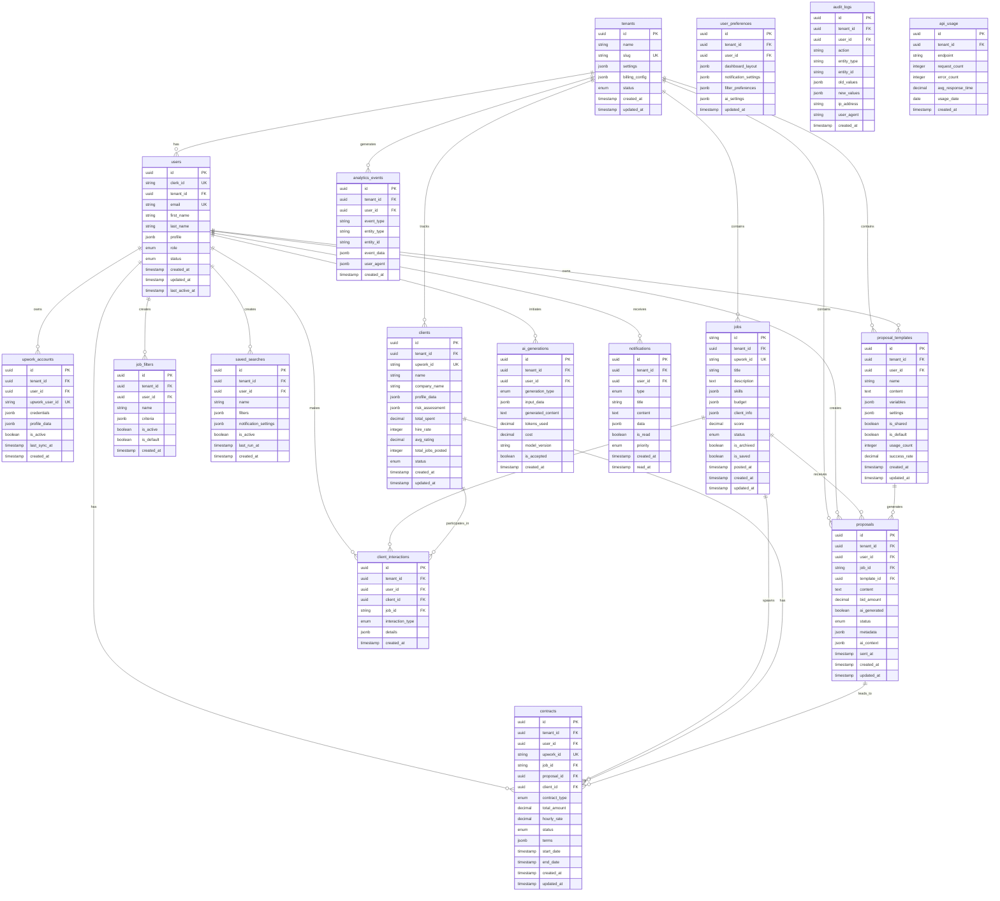

# Database Schema Design - Multi-Tenant Architecture

## 🗄️ Database Architecture Overview

### **Multi-Tenancy Strategy**
- **Shared Schema with Row-Level Security (RLS)** for optimal cost and performance
- **PostgreSQL RLS policies** for data isolation
- **Composite indexes** on `(tenant_id, ...)` for optimal query performance
- **Future-ready** for schema-per-tenant or database-per-tenant if needed

### **Core Design Principles**
1. **Data Isolation** - Complete tenant data separation via RLS
2. **Performance** - Optimized indexes and query patterns
3. **Scalability** - Designed for 1000+ tenants
4. **Auditability** - Complete audit trail for all changes
5. **GDPR Compliance** - Data retention and deletion capabilities

## 📊 Entity Relationship Diagram



## 🗃️ Detailed Table Schemas

### **Core Tables**

#### **Tenants Table**
```sql
CREATE TABLE tenants (
    id UUID PRIMARY KEY DEFAULT gen_random_uuid(),
    name VARCHAR(255) NOT NULL,
    slug VARCHAR(100) UNIQUE NOT NULL,
    settings JSONB DEFAULT '{}',
    billing_config JSONB DEFAULT '{}',
    status tenant_status DEFAULT 'active',
    created_at TIMESTAMPTZ DEFAULT NOW(),
    updated_at TIMESTAMPTZ DEFAULT NOW()
);

CREATE TYPE tenant_status AS ENUM ('active', 'suspended', 'cancelled');

-- Indexes
CREATE INDEX idx_tenants_slug ON tenants(slug);
CREATE INDEX idx_tenants_status ON tenants(status);
```

#### **Users Table**
```sql
CREATE TABLE users (
    id UUID PRIMARY KEY DEFAULT gen_random_uuid(),
    clerk_id VARCHAR(100) UNIQUE NOT NULL,
    tenant_id UUID NOT NULL REFERENCES tenants(id) ON DELETE CASCADE,
    email VARCHAR(255) UNIQUE NOT NULL,
    first_name VARCHAR(100),
    last_name VARCHAR(100),
    profile JSONB DEFAULT '{}',
    role user_role DEFAULT 'member',
    status user_status DEFAULT 'active',
    created_at TIMESTAMPTZ DEFAULT NOW(),
    updated_at TIMESTAMPTZ DEFAULT NOW(),
    last_active_at TIMESTAMPTZ DEFAULT NOW()
);

CREATE TYPE user_role AS ENUM ('owner', 'admin', 'member', 'viewer');
CREATE TYPE user_status AS ENUM ('active', 'inactive', 'suspended');

-- Indexes
CREATE INDEX idx_users_tenant_id ON users(tenant_id);
CREATE INDEX idx_users_clerk_id ON users(clerk_id);
CREATE INDEX idx_users_email ON users(email);
CREATE INDEX idx_users_tenant_role ON users(tenant_id, role);

-- RLS Policy
ALTER TABLE users ENABLE ROW LEVEL SECURITY;
CREATE POLICY tenant_isolation_users ON users
    USING (tenant_id = current_setting('app.tenant_id')::uuid);
```

#### **Upwork Accounts Table**
```sql
CREATE TABLE upwork_accounts (
    id UUID PRIMARY KEY DEFAULT gen_random_uuid(),
    tenant_id UUID NOT NULL REFERENCES tenants(id) ON DELETE CASCADE,
    user_id UUID NOT NULL REFERENCES users(id) ON DELETE CASCADE,
    upwork_user_id VARCHAR(100) UNIQUE NOT NULL,
    credentials JSONB NOT NULL, -- Encrypted API keys
    profile_data JSONB DEFAULT '{}',
    is_active BOOLEAN DEFAULT true,
    last_sync_at TIMESTAMPTZ,
    created_at TIMESTAMPTZ DEFAULT NOW()
);

-- Indexes
CREATE INDEX idx_upwork_accounts_tenant_id ON upwork_accounts(tenant_id);
CREATE INDEX idx_upwork_accounts_user_id ON upwork_accounts(user_id);
CREATE INDEX idx_upwork_accounts_upwork_id ON upwork_accounts(upwork_user_id);

-- RLS Policy
ALTER TABLE upwork_accounts ENABLE ROW LEVEL SECURITY;
CREATE POLICY tenant_isolation_upwork_accounts ON upwork_accounts
    USING (tenant_id = current_setting('app.tenant_id')::uuid);
```

### **Job Management Tables**

#### **Jobs Table**
```sql
CREATE TABLE jobs (
    id VARCHAR(100) PRIMARY KEY, -- Upwork job ID
    tenant_id UUID NOT NULL REFERENCES tenants(id) ON DELETE CASCADE,
    upwork_id VARCHAR(100) UNIQUE NOT NULL,
    title VARCHAR(500) NOT NULL,
    description TEXT NOT NULL,
    skills JSONB DEFAULT '[]',
    budget JSONB DEFAULT '{}', -- {type: 'hourly'|'fixed', min: number, max: number}
    client_info JSONB DEFAULT '{}',
    score DECIMAL(3,2) DEFAULT 0, -- AI-generated quality score 0-10
    status job_status DEFAULT 'active',
    is_archived BOOLEAN DEFAULT false,
    is_saved BOOLEAN DEFAULT false,
    posted_at TIMESTAMPTZ,
    created_at TIMESTAMPTZ DEFAULT NOW(),
    updated_at TIMESTAMPTZ DEFAULT NOW()
);

CREATE TYPE job_status AS ENUM ('active', 'closed', 'expired', 'draft');

-- Indexes for optimal filtering performance
CREATE INDEX idx_jobs_tenant_id ON jobs(tenant_id);
CREATE INDEX idx_jobs_tenant_status ON jobs(tenant_id, status);
CREATE INDEX idx_jobs_tenant_score ON jobs(tenant_id, score DESC);
CREATE INDEX idx_jobs_tenant_posted ON jobs(tenant_id, posted_at DESC);
CREATE INDEX idx_jobs_skills ON jobs USING GIN(skills);
CREATE INDEX idx_jobs_client_info ON jobs USING GIN(client_info);

-- RLS Policy
ALTER TABLE jobs ENABLE ROW LEVEL SECURITY;
CREATE POLICY tenant_isolation_jobs ON jobs
    USING (tenant_id = current_setting('app.tenant_id')::uuid);
```

#### **Job Filters Table**
```sql
CREATE TABLE job_filters (
    id UUID PRIMARY KEY DEFAULT gen_random_uuid(),
    tenant_id UUID NOT NULL REFERENCES tenants(id) ON DELETE CASCADE,
    user_id UUID NOT NULL REFERENCES users(id) ON DELETE CASCADE,
    name VARCHAR(255) NOT NULL,
    criteria JSONB NOT NULL,
    is_active BOOLEAN DEFAULT true,
    is_default BOOLEAN DEFAULT false,
    created_at TIMESTAMPTZ DEFAULT NOW()
);

-- Indexes
CREATE INDEX idx_job_filters_tenant_user ON job_filters(tenant_id, user_id);
CREATE INDEX idx_job_filters_active ON job_filters(tenant_id, user_id, is_active);

-- RLS Policy
ALTER TABLE job_filters ENABLE ROW LEVEL SECURITY;
CREATE POLICY tenant_isolation_job_filters ON job_filters
    USING (tenant_id = current_setting('app.tenant_id')::uuid);
```

### **Proposal Management Tables**

#### **Proposals Table**
```sql
CREATE TABLE proposals (
    id UUID PRIMARY KEY DEFAULT gen_random_uuid(),
    tenant_id UUID NOT NULL REFERENCES tenants(id) ON DELETE CASCADE,
    user_id UUID NOT NULL REFERENCES users(id) ON DELETE CASCADE,
    job_id VARCHAR(100) NOT NULL REFERENCES jobs(id) ON DELETE CASCADE,
    template_id UUID REFERENCES proposal_templates(id),
    content TEXT NOT NULL,
    bid_amount DECIMAL(10,2),
    ai_generated BOOLEAN DEFAULT false,
    status proposal_status DEFAULT 'draft',
    metadata JSONB DEFAULT '{}',
    ai_context JSONB DEFAULT '{}', -- Context used for AI generation
    sent_at TIMESTAMPTZ,
    created_at TIMESTAMPTZ DEFAULT NOW(),
    updated_at TIMESTAMPTZ DEFAULT NOW()
);

CREATE TYPE proposal_status AS ENUM ('draft', 'sent', 'viewed', 'shortlisted', 'interviewed', 'accepted', 'rejected', 'withdrawn');

-- Indexes
CREATE INDEX idx_proposals_tenant_user ON proposals(tenant_id, user_id);
CREATE INDEX idx_proposals_status ON proposals(tenant_id, status);
CREATE INDEX idx_proposals_created ON proposals(tenant_id, created_at DESC);
CREATE INDEX idx_proposals_job_id ON proposals(job_id);

-- RLS Policy
ALTER TABLE proposals ENABLE ROW LEVEL SECURITY;
CREATE POLICY tenant_isolation_proposals ON proposals
    USING (tenant_id = current_setting('app.tenant_id')::uuid);
```

#### **Proposal Templates Table**
```sql
CREATE TABLE proposal_templates (
    id UUID PRIMARY KEY DEFAULT gen_random_uuid(),
    tenant_id UUID NOT NULL REFERENCES tenants(id) ON DELETE CASCADE,
    user_id UUID NOT NULL REFERENCES users(id) ON DELETE CASCADE,
    name VARCHAR(255) NOT NULL,
    content TEXT NOT NULL,
    variables JSONB DEFAULT '[]', -- Template variables: [{name, type, default}]
    settings JSONB DEFAULT '{}',
    is_shared BOOLEAN DEFAULT false, -- Shared within tenant
    is_default BOOLEAN DEFAULT false,
    usage_count INTEGER DEFAULT 0,
    success_rate DECIMAL(5,2) DEFAULT 0, -- Percentage 0-100
    created_at TIMESTAMPTZ DEFAULT NOW(),
    updated_at TIMESTAMPTZ DEFAULT NOW()
);

-- Indexes
CREATE INDEX idx_templates_tenant_user ON proposal_templates(tenant_id, user_id);
CREATE INDEX idx_templates_shared ON proposal_templates(tenant_id, is_shared);
CREATE INDEX idx_templates_success_rate ON proposal_templates(tenant_id, success_rate DESC);

-- RLS Policy
ALTER TABLE proposal_templates ENABLE ROW LEVEL SECURITY;
CREATE POLICY tenant_isolation_templates ON proposal_templates
    USING (tenant_id = current_setting('app.tenant_id')::uuid);
```

### **Client Management Tables**

#### **Clients Table**
```sql
CREATE TABLE clients (
    id UUID PRIMARY KEY DEFAULT gen_random_uuid(),
    tenant_id UUID NOT NULL REFERENCES tenants(id) ON DELETE CASCADE,
    upwork_id VARCHAR(100) UNIQUE NOT NULL,
    name VARCHAR(255),
    company_name VARCHAR(255),
    profile_data JSONB DEFAULT '{}',
    risk_assessment JSONB DEFAULT '{}',
    total_spent DECIMAL(12,2) DEFAULT 0,
    hire_rate INTEGER DEFAULT 0, -- Percentage 0-100
    avg_rating DECIMAL(3,2) DEFAULT 0,
    total_jobs_posted INTEGER DEFAULT 0,
    status client_status DEFAULT 'active',
    created_at TIMESTAMPTZ DEFAULT NOW(),
    updated_at TIMESTAMPTZ DEFAULT NOW()
);

CREATE TYPE client_status AS ENUM ('active', 'blacklisted', 'preferred', 'unknown');

-- Indexes
CREATE INDEX idx_clients_tenant_id ON clients(tenant_id);
CREATE INDEX idx_clients_upwork_id ON clients(upwork_id);
CREATE INDEX idx_clients_risk_score ON clients(tenant_id, ((risk_assessment->>'score')::numeric) DESC);
CREATE INDEX idx_clients_total_spent ON clients(tenant_id, total_spent DESC);

-- RLS Policy
ALTER TABLE clients ENABLE ROW LEVEL SECURITY;
CREATE POLICY tenant_isolation_clients ON clients
    USING (tenant_id = current_setting('app.tenant_id')::uuid);
```

### **Analytics & Monitoring Tables**

#### **Analytics Events Table**
```sql
CREATE TABLE analytics_events (
    id UUID PRIMARY KEY DEFAULT gen_random_uuid(),
    tenant_id UUID NOT NULL REFERENCES tenants(id) ON DELETE CASCADE,
    user_id UUID REFERENCES users(id) ON DELETE SET NULL,
    event_type VARCHAR(100) NOT NULL,
    entity_type VARCHAR(50),
    entity_id VARCHAR(100),
    event_data JSONB DEFAULT '{}',
    user_agent TEXT,
    created_at TIMESTAMPTZ DEFAULT NOW()
);

-- Indexes for analytics queries
CREATE INDEX idx_analytics_tenant_type ON analytics_events(tenant_id, event_type);
CREATE INDEX idx_analytics_tenant_created ON analytics_events(tenant_id, created_at DESC);
CREATE INDEX idx_analytics_user_type ON analytics_events(user_id, event_type);
CREATE INDEX idx_analytics_entity ON analytics_events(entity_type, entity_id);

-- RLS Policy
ALTER TABLE analytics_events ENABLE ROW LEVEL SECURITY;
CREATE POLICY tenant_isolation_analytics ON analytics_events
    USING (tenant_id = current_setting('app.tenant_id')::uuid);
```

#### **AI Generations Table**
```sql
CREATE TABLE ai_generations (
    id UUID PRIMARY KEY DEFAULT gen_random_uuid(),
    tenant_id UUID NOT NULL REFERENCES tenants(id) ON DELETE CASCADE,
    user_id UUID NOT NULL REFERENCES users(id) ON DELETE CASCADE,
    generation_type ai_generation_type NOT NULL,
    input_data JSONB NOT NULL,
    generated_content TEXT NOT NULL,
    tokens_used INTEGER DEFAULT 0,
    cost DECIMAL(8,4) DEFAULT 0,
    model_version VARCHAR(50),
    is_accepted BOOLEAN DEFAULT false,
    created_at TIMESTAMPTZ DEFAULT NOW()
);

CREATE TYPE ai_generation_type AS ENUM ('proposal', 'job_analysis', 'client_research', 'voice_matching');

-- Indexes
CREATE INDEX idx_ai_generations_tenant_user ON ai_generations(tenant_id, user_id);
CREATE INDEX idx_ai_generations_type ON ai_generations(tenant_id, generation_type);
CREATE INDEX idx_ai_generations_cost ON ai_generations(tenant_id, created_at, cost);

-- RLS Policy
ALTER TABLE ai_generations ENABLE ROW LEVEL SECURITY;
CREATE POLICY tenant_isolation_ai_generations ON ai_generations
    USING (tenant_id = current_setting('app.tenant_id')::uuid);
```

## 🔒 Security Implementation

### **Row-Level Security Setup**
```sql
-- Enable RLS on all tenant tables
ALTER TABLE users ENABLE ROW LEVEL SECURITY;
ALTER TABLE jobs ENABLE ROW LEVEL SECURITY;
ALTER TABLE proposals ENABLE ROW LEVEL SECURITY;
ALTER TABLE clients ENABLE ROW LEVEL SECURITY;
-- ... (all other tables)

-- Create tenant isolation function
CREATE OR REPLACE FUNCTION set_tenant(tenant_id UUID)
RETURNS VOID AS $$
BEGIN
    PERFORM set_config('app.tenant_id', tenant_id::text, true);
END;
$$ LANGUAGE plpgsql SECURITY DEFINER;

-- Create policies for each table
CREATE POLICY tenant_isolation_users ON users
    USING (tenant_id = current_setting('app.tenant_id')::uuid);

CREATE POLICY tenant_isolation_jobs ON jobs
    USING (tenant_id = current_setting('app.tenant_id')::uuid);

-- Repeat for all tables...
```

### **Database Roles & Permissions**
```sql
-- Application role with minimal permissions
CREATE ROLE app_user;
GRANT CONNECT ON DATABASE upwork_ai_agent TO app_user;
GRANT USAGE ON SCHEMA public TO app_user;
GRANT SELECT, INSERT, UPDATE, DELETE ON ALL TABLES IN SCHEMA public TO app_user;
GRANT USAGE, SELECT ON ALL SEQUENCES IN SCHEMA public TO app_user;
GRANT EXECUTE ON FUNCTION set_tenant(UUID) TO app_user;

-- Read-only role for analytics
CREATE ROLE analytics_user;
GRANT CONNECT ON DATABASE upwork_ai_agent TO analytics_user;
GRANT USAGE ON SCHEMA public TO analytics_user;
GRANT SELECT ON ALL TABLES IN SCHEMA public TO analytics_user;
```

## 📈 Performance Optimization

### **Strategic Indexing**
```sql
-- Composite indexes for common query patterns
CREATE INDEX idx_jobs_tenant_filters ON jobs(tenant_id, status, score DESC, posted_at DESC);
CREATE INDEX idx_proposals_tenant_user_status ON proposals(tenant_id, user_id, status, created_at DESC);
CREATE INDEX idx_analytics_tenant_time ON analytics_events(tenant_id, created_at DESC) WHERE created_at >= NOW() - INTERVAL '90 days';

-- Partial indexes for hot data
CREATE INDEX idx_jobs_active ON jobs(tenant_id, posted_at DESC) WHERE status = 'active' AND NOT is_archived;
CREATE INDEX idx_proposals_recent ON proposals(tenant_id, user_id, created_at DESC) WHERE created_at >= NOW() - INTERVAL '30 days';
```

### **Database Configuration**
```sql
-- Optimize for read-heavy workload
SET shared_buffers = '256MB';
SET effective_cache_size = '1GB';
SET random_page_cost = 1.1;
SET default_statistics_target = 100;

-- Connection pooling settings
SET max_connections = 100;
SET shared_preload_libraries = 'pg_stat_statements';
```

## 🔄 Data Lifecycle Management

### **Archival Strategy**
```sql
-- Archive old analytics events (90 days retention)
CREATE TABLE analytics_events_archive (LIKE analytics_events);

-- Automated archival function
CREATE OR REPLACE FUNCTION archive_old_analytics()
RETURNS INTEGER AS $$
DECLARE
    archived_count INTEGER;
BEGIN
    WITH archived AS (
        DELETE FROM analytics_events
        WHERE created_at < NOW() - INTERVAL '90 days'
        RETURNING *
    )
    INSERT INTO analytics_events_archive SELECT * FROM archived;

    GET DIAGNOSTICS archived_count = ROW_COUNT;
    RETURN archived_count;
END;
$$ LANGUAGE plpgsql;

-- Schedule archival (use pg_cron or external scheduler)
```

### **Backup Strategy**
```sql
-- Point-in-time recovery setup
archive_mode = on
archive_command = 'test ! -f /backup/archive/%f && cp %p /backup/archive/%f'
wal_level = replica
max_wal_senders = 3
```

This database schema provides a robust, scalable foundation for the multi-tenant AI Upwork Agent platform with proper security, performance optimization, and data lifecycle management.